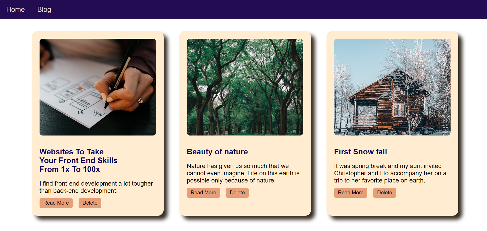
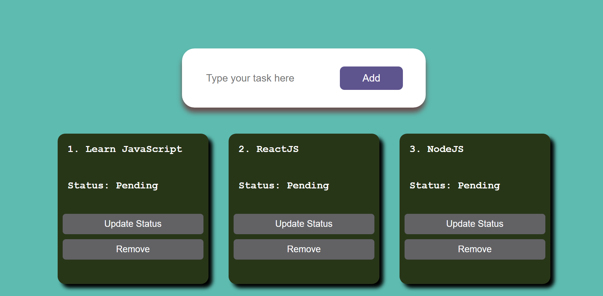

# MileStone_Repo.
Repository containing skill-enhancing projects assigned by PW Skills.

Welcome to MileStone_Repo! This repository contains three web development projects showcasing different skills and technologies, ranging from static web pages to dynamic web applications. Below is a brief overview of each project:

## 1. Blog Site
A static blog site built using HTML, CSS, and JavaScript. It showcases various blog posts, a home page, and a blog page. This project serves as a foundation for understanding front-end web development.

## 2. Movie Search App
An interactive movie search application using HTML, CSS, and JavaScript. The app fetches movie information from the Open Movie Database (OMDb) API based on user queries. It demonstrates how to work with APIs and dynamically display data on a webpage.

## 3. Todo Web App with React
A dynamic Todo web application built using React JS. Users can add, delete, and update tasks in real-time. React's component-based architecture is utilized to efficiently manage state and provide a smooth user experience.

## How to Run the Projects

Each project is self-contained within its respective folder. To run any of the projects locally, follow the instructions below:

### Blog Site:
1. Navigate to the Project01 folder.
2. Open the "index.html" file in your web browser.

### Movie Search App:
1. Navigate to the Project_02 folder.
2. Open the "index.html" file in your web browser.

### Todo Web App with React:
1. Navigate to the Project_03 folder.
2. Make sure you have Node.js and npm (Node Package Manager) installed.
3. Run the following commands in your terminal:

The Todo app should now be running on http://localhost:5000 in your web browser.

## Contributions
Contributions, bug reports, and feature requests are welcome! If you find any issues or have ideas to improve the projects, feel free to create an issue or submit a pull request.

## Contact
If you have any questions or inquiries, you can reach me via email at "https://www.linkedin.com/in/itspiyush78" or connect with me on GitHub.

Happy coding!

